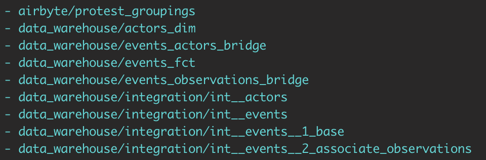
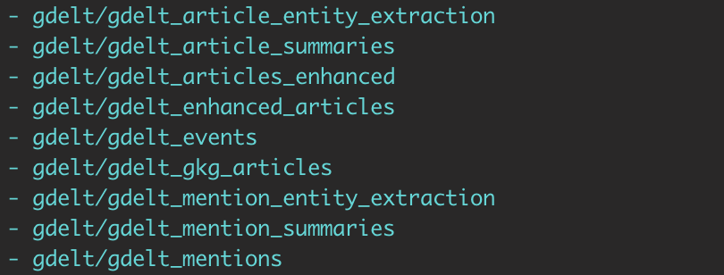
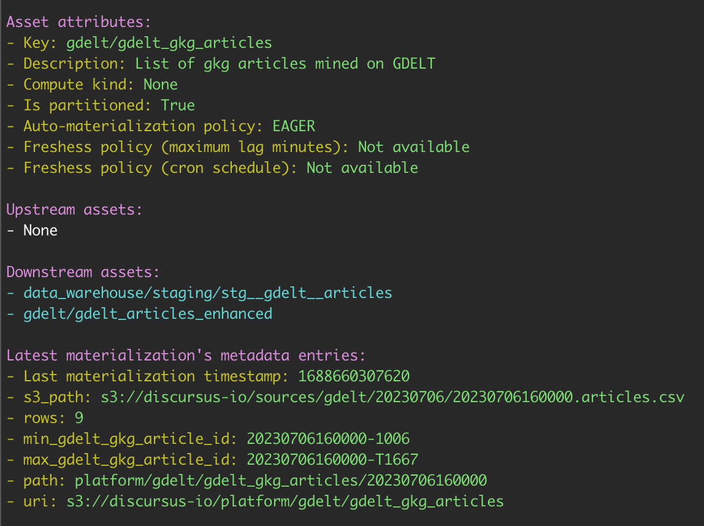

    ████████▄     ▄████████   ▄▄▄▄███▄▄▄▄   ███▄▄▄▄   
    ███   ▀███   ███    ███ ▄██▀▀▀███▀▀▀██▄ ███▀▀▀██▄ 
    ███    ███   ███    ███ ███   ███   ███ ███   ███ 
    ███    ███   ███    ███ ███   ███   ███ ███   ███ 
    ███    ███ ▀███████████ ███   ███   ███ ███   ███ 
    ███    ███   ███    ███ ███   ███   ███ ███   ███ 
    ███   ▄███   ███    ███ ███   ███   ███ ███   ███ 
    ████████▀    ███    █▀   ▀█   ███   █▀   ▀█   █▀                                                 

# Data Asset Metrics Navigator
The DAMN tool extracts and reports metrics about your data assets.

It allows you to inspect your assets, lineage, and all sorts of metrics around materialization, usage, physical space usage and query performance. The objective of the DAMN tool is to give you a convenient command-line tool to track and report on the data assets you're working on.

## Installation
To install the DAMN tool, run the following command:

```bash
pip install damn-tool
```

## Connectors
The DAMN tool depends on connectors to your platform's services, such as orchestrators, data warehouses, file storage, API, etc.

### Dagster
This is for the moment the default and only connector supported by the DAMN tool. You'll need to set the following 2 environment variables to make it work:
- DAGSTER_GRAPHQL_URL, which points to your Dagster GraphQL instance
- DAGSTER_CLOUD_API_TOKEN, which is to authenticate you with your Dagster GraphQL instance


## Usage
Here are some examples of how to use this CLI tool:

### List assets
```bash
foo@bar:~$ damn ls
```



List all assets for a specifc key group
```bash
foo@bar:~$ damn ls --prefix gdelt
```



### Show details for a specific asset
```bash
foo@bar:~$ damn show gdelt/gdelt_gkg_articles
```




## Contribution
Contributions to the DAMN tool are always welcome. Whether it's feature requests, bug fixes, or new features, your contribution is appreciated.


## License
The DAMN tool is open-source software, licensed under MIT.